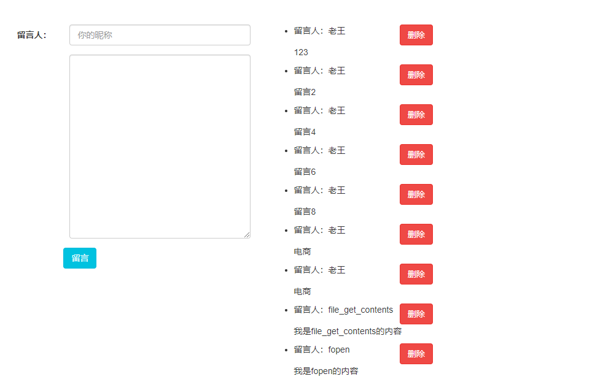

# Imooc_php_http
慕课网[php http协议课程](https://www.imooc.com/learn/758)部分源码，用jquery ajax写了个单页留言板。

# 使用方法
文件夹1,2分别对应课程章节1,2。

由于留言板使用easydb库完成了curd,因此使用留言板首先切换到2目录，然后用`composer install`命令安装easydb库。

表文件message.sql在doc文件下。

# 使用的库

## php
*[easydb](https://github.com/paragonie/easydb) 一个简单的curd库。

## 前端
* [jquery](https://github.com/jquery/jquery)

* [bootstrap](https://github.com/search?q=bootstrap)

# 留言板截屏

